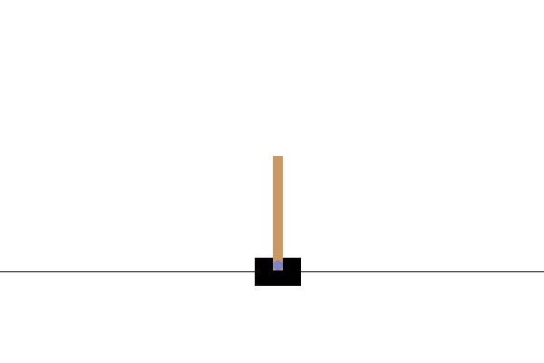

# CartPole PPO Starter

This project is a **clean, self‑contained example** of training and evaluating a
Proximal Policy Optimization (PPO) agent on the classic **CartPole‑v1**
environment using **Stable‑Baselines3** and **Gymnasium**.

It is designed to be:

- Easy to run and modify.
- Clear enough to read and learn from.
- A small but realistic RL baseline you can reuse in other work.

---

## 🧩 What This Project Does

- Trains a PPO agent to **balance the pole** in `CartPole-v1`.
- Logs rewards and produces a **training curve image**.
- Evaluates the final policy and reports **mean / min / max return**.
- Records **short videos** of the trained agent interacting with the environment.

Conceptual view:



---

## 📂 Project Structure

- `cartpole/`
  - `cartpole_ppo_train.py` – train PPO on CartPole‑v1 with configurable hyperparameters.
  - `cartpole_ppo_infer.py` – run the trained policy and render episodes.
  - `cartpole_ppo.ipynb` – notebook walkthrough for interactive training/plots.
  - `cartpole_eval.py` – evaluate the trained model and print summary statistics.
  - `cartpole_record_video.py` – record episodes to `.mp4` videos.
- `notes/`
  - `rl_basics.md` – reinforcement learning fundamentals (MDP, value functions, etc.).
  - `ppo_explained.md` – intuitive explanation of PPO and its clipped objective.
  - `experiment_template.md` – template for logging experiments in a thesis‑style way.
- `images/`
  - `cartpole_env.png` – single frame of the CartPole environment (for docs).
  - `cartpole_graph.png` – reward curve generated by the training script.

---

## ⚙️ Setup

From this project’s root (`cartpole-ppo-starter/`):

```bash
python -m venv .venv
source .venv/bin/activate      # Linux/macOS
# or
.venv\Scripts\activate         # Windows

python -m pip install --upgrade pip
python -m pip install -r requirements.txt
```

Dependencies include:

- `gymnasium` and `stable-baselines3` for RL.
- `torch`, `numpy`, `matplotlib`, `pandas`, `seaborn` for learning and plotting.
- `moviepy` for saving videos.
- `jupyter` / `ipykernel` for the notebook.

---

## 🚀 Training the PPO Agent

Basic training run:

```bash
python cartpole/cartpole_ppo_train.py --timesteps 200000
```

Key options:

- `--timesteps` – total environment interaction steps (e.g. `200000`).
- `--seed` – random seed (default `0`).
- `--model-name` – base name for the saved model (default `cartpole_ppo_model`).
- `--learning-rate` – PPO learning rate (default `3e-4`).
- `--batch-size` – PPO batch size (default `64`).

What training produces:

- Model checkpoint:
  - `cartpole/models/cartpole_ppo_model.zip`
- Reward curve images:
  - `cartpole/training_plot.png`
  - `images/cartpole_graph.png`

Example training curve:


---

## 📊 Evaluating the Trained Policy

After training, evaluate performance over several episodes:

```bash
python cartpole/cartpole_eval.py --episodes 20
```

This prints:

- Mean return.
- Standard deviation of returns.
- Minimum and maximum return over the evaluation runs.

This is useful when you want reproducible numbers for reports or comparisons.

---

## 👀 Visualizing the Agent

To watch the trained agent interact with the environment in a render window:

```bash
python cartpole/cartpole_ppo_infer.py --episodes 5
```

This uses `render_mode="human"` so you can see the cart and pole balancing in real time.

---

## 🎥 Recording Videos

To record `.mp4` videos of the trained agent:

```bash
python cartpole/cartpole_record_video.py --episodes 3
```

Videos are saved under:

```text
videos/cartpole/
```

For example:

- `videos/cartpole/cartpole_ppo-episode-0.mp4`
- `videos/cartpole/cartpole_ppo-episode-1.mp4`

### Demo Video in GitHub

GitHub does not render `<video>` tags inside README files, so an embedded
player will not appear. Instead, click the link (or image) below to open the
video in the GitHub UI:

- [▶️ Watch CartPole PPO video](https://github.com/deviharshd/cartpole-ppo-starter/blob/main/videos/cartpole/cartpole_ppo-episode-0.mp4)

Or click the training curve thumbnail:

[](https://github.com/deviharshd/cartpole-ppo-starter/blob/main/videos/cartpole/cartpole_ppo-episode-0.mp4)

---

## 🧠 Learning Resources in `notes/`

If you’re using this project to learn RL or write a report/thesis:

- `notes/rl_basics.md` – covers MDPs, policies, value functions, exploration vs exploitation.
- `notes/ppo_explained.md` – explains PPO’s clipped surrogate loss, advantage estimation, and why PPO works well for continuous control and locomotion tasks.
- `notes/experiment_template.md` – copy this file to log each experiment (seed, timesteps, hyperparameters, results).

These notes are meant to be directly reusable in your own documentation.
